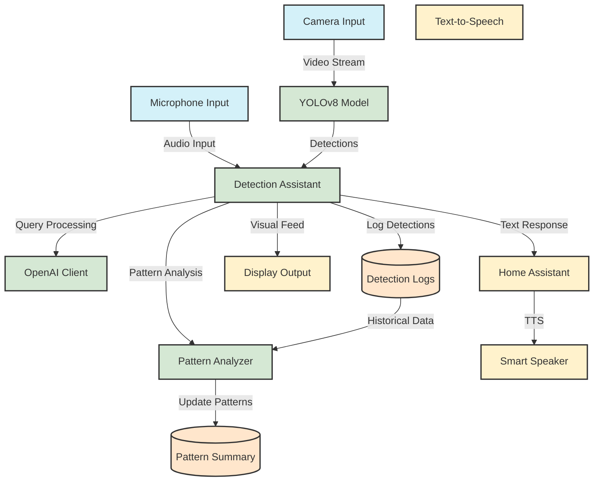

# Vision-Aware Smart Assistant

A smart assistant that uses computer vision and natural language processing to detect and respond to objects in its environment.

## System Architecture


## Project Structure

```
vision-assistant/
├── src/                    # Source code
│   ├── core/              # Core functionality
│   │   ├── assistant.py   # Main detection and voice assistant
│   │   ├── voice_loop.py  # Voice interaction loop
│   │   ├── openai_assistant.py  # OpenAI integration
│   │   └── tts.py        # Text-to-speech utilities
│   ├── models/            # ML models
│   │   ├── yolov8_model.py
│   │   └── base_model.py
│   ├── utils/             # Utility functions
│   │   ├── audio.py      # Audio device handling
│   │   ├── combine_logs.py
│   │   └── openai_utils.py
│   └── config/            # Configuration
│       └── settings.py
├── data/                  # Data directory (not in git)
│   ├── raw/              # Raw detection logs
│   └── processed/        # Processed logs
├── docs/                  # Documentation
│   ├── reports/          # Project reports (not in git)
│   ├── data_setup.md     # Data setup guide
│   ├── windows_setup.md  # Windows setup guide
│   └── home_assistant_setup.md  # Home Assistant setup guide
├── models/               # Model weights (not in git)
│   └── yolov8/          # YOLOv8 weights
├── tools/               # Utility scripts
│   └── generate_fake_logs.py
└── requirements.txt     # Python dependencies
```

## Setup

### Prerequisites

- Python 3.10 or higher
- Git
- Webcam
- Microphone
- Docker (for Home Assistant)
- Internet connection
- Mamba or Conda (recommended for environment management)

### Installation

1. Clone the repository:
   ```bash
   git clone https://github.com/yourusername/vision-assistant.git
   cd vision-assistant
   ```

2. Create and activate the environment using Mamba (recommended) or Conda:
   ```bash
   # Using Mamba
   mamba env create -f docs/environment.yml
   mamba activate vision-assistant

   # Or using Conda
   conda env create -f docs/environment.yml
   conda activate vision-assistant
   ```

3. Download the YOLOv8 model:
   ```bash
   # The model will be downloaded automatically on first run
   # Or download manually:
   wget https://github.com/ultralytics/assets/releases/download/v0.0.0/yolov8n.pt -O models/yolov8n.pt
   ```

4. Set up data directories:
   ```bash
   mkdir -p data/raw data/processed
   ```

5. Generate test data (optional):
   ```bash
   # Generate 7 days of test data
   ./tools/generate_fake_logs.py

   # Or generate custom amount of data
   python tools/generate_fake_logs.py --days 14 --detections 200
   ```

6. Set up Home Assistant (for TTS functionality):
   - Install Home Assistant using Docker
   - Enable the Text-to-Speech integration
   - Create a long-lived access token
   - Recommended: Use Nabu Casa Cloud for better TTS quality

7. Create a `.env` file with your configuration:
   ```bash
   cp .env.example .env
   # Edit .env with your settings:
   # - HOME_ASSISTANT_URL
   # - HOME_ASSISTANT_TOKEN
   # - OPENAI_API_KEY (for pattern analysis)
   ```

## Running the Assistant

1. Start Home Assistant (if using local instance):
   ```bash
   docker run -d \
     --name homeassistant \
     --privileged \
     --restart=unless-stopped \
     -e TZ=your_timezone \
     -v ~/.homeassistant:/config \
     --network=host \
     ghcr.io/home-assistant/home-assistant:stable
   ```

2. Run the assistant:
   ```bash
   python run_assistant.py
   ```

3. Interact with the assistant using voice commands:
   - "What do you see right now?"
   - "When do you usually see the bus?"
   - "What time does the bus come?"
   - "Is there a regular pattern for bus detections?"
   - "What patterns have you noticed in the detections?"

## Data Generation and Management

The assistant stores detection logs in the `data/raw` directory. Each day's detections are stored in a separate CSV file with the format `detections_YYYY_MM_DD.csv`.

### Generating Test Data

The `tools/generate_fake_logs.py` script creates realistic test data with:
- Timestamps throughout each day
- Multiple object detections per timestamp
- Realistic confidence scores and counts
- Various object categories (people, vehicles, animals, etc.)

See `tools/README.md` for detailed usage instructions.

### Data Format

Each detection log file contains:
- Timestamp of detection
- Up to 3 detected objects per timestamp
- Count and confidence score for each detection

Example:
```csv
timestamp,label_1,count_1,avg_conf_1,label_2,count_2,avg_conf_2,label_3,count_3,avg_conf_3
2024-03-20 08:15:23,person,2,0.923,car,1,0.856,,
2024-03-20 08:16:45,dog,1,0.912,,
2024-03-20 08:17:12,bus,1,0.945,person,3,0.891,
```

## Features

- Real-time object detection using YOLOv8
- Voice interaction using speech recognition
- Natural language processing for query understanding
- Pattern recognition in detection logs
- Text-to-speech responses via Home Assistant
- Cross-platform support (Linux, Windows, macOS)

## Documentation

- [Data Setup Guide](docs/data_setup.md) - How to set up and generate test data
- [Windows Setup Guide](docs/windows_setup.md) - Windows-specific setup instructions
- [Home Assistant Setup Guide](docs/home_assistant_setup.md) - Docker setup and configuration
- [Models Guide](models/README.md) - Information about model weights and setup
- [Test Questions](docs/assistant_test_questions.txt) - Sample questions for testing

## Contributing

1. Fork the repository
2. Create a feature branch
3. Commit your changes
4. Push to the branch
5. Create a Pull Request

## License

This project is licensed under the MIT License - see the LICENSE file for details.

## Project Overview
This project is a modular, voice-driven, vision-aware assistant that integrates live object detection (YOLOv8), historical log analysis, and natural language voice interaction. The system can answer both live and historical queries about detected objects, using the current camera feed and combined detection logs. It features robust intent detection, partial/fuzzy matching, and seamless integration with Home Assistant for text-to-speech (TTS) output.

## Technologies Used
- **Python 3.10**
- **YOLOv8** for object detection
- **OpenAI API** for code interpreter and pattern analysis
- **SpeechRecognition** and **gTTS** for voice input/output
- **OpenCV** for camera and image processing
- **Home Assistant** for TTS and smart home integration
- **Pandas, NumPy, scikit-learn** for data analysis
- **Requests, python-dotenv** for API and environment management

## Home Assistant Integration
Home Assistant is an open-source home automation platform. In this project, it is used to play TTS responses on a smart speaker. The assistant sends HTTP requests to Home Assistant's TTS service, which then vocalizes responses to the user.

## Setup Instructions

### Linux Setup
1. Install [Mamba](https://mamba.readthedocs.io/en/latest/installation.html) or [Conda](https://docs.conda.io/en/latest/miniconda.html).
2. Create the environment:
   ```
   mamba env create -f docs/environment.yml
   # or
   conda env create -f docs/environment.yml
   ```
3. Activate the environment:
   ```
   mamba activate vision-assistant
   # or
   conda activate vision-assistant
   ```
4. Set up your `.env` file with OpenAI and Home Assistant tokens.
5. Run the main assistant script as described below.

### Windows Setup
For Windows users, please refer to the detailed setup guide in `docs/windows_setup.md`. The guide covers:
- Prerequisites installation
- Project setup
- Audio configuration
- Home Assistant setup
- Common troubleshooting

## Codebase Structure and File Descriptions

### src/core/
- **assistant.py**: Main detection and voice assistant logic. Handles camera, detection buffer, query routing, and TTS output. Inputs: camera frames, voice input. Outputs: TTS responses, detection logs.
- **voice_loop.py**: Manages the main loop for voice and detection, including query classification and routing.
- **openai_assistant.py**: Handles OpenAI API integration for code interpreter and pattern analysis.
- **tts.py**: Utility for sending TTS messages to Home Assistant.

### src/utils/
- **audio.py**: Cross-platform microphone selection and audio device utilities. Supports both Linux and Windows systems.
- **openai_utils.py**: Helper functions for OpenAI API usage.
- **combine_logs.py**: Combines daily detection logs into a single CSV for historical analysis.

### src/models/
- **yolov8_model.py**: Wrapper for YOLOv8 object detection model.
- **yolov5_model.py**: Wrapper for YOLOv5 object detection model.
- **base_model.py**: Base class for detection models.

### src/config/
- **settings.py**: Centralized configuration for paths, camera, logging, audio, and Home Assistant.

### tools/
- **generate_fake_logs.py**: Generates synthetic detection logs for testing.
- **estimate_token_usage.py**: Estimates OpenAI API token usage for logs.

### Data Organization
- **data/raw/**: Original detection logs
- **data/processed/**: Combined and processed detection logs
- **data/logs/**: Application logs

### Other
- **docs/assistant_test_questions.txt**: List of test questions for all objects.
- **docs/environment.yml**: Environment specification for reproducibility.
- **docs/windows_setup.md**: Detailed Windows setup guide.

## What Has Been Accomplished
- Live object detection with YOLOv8 and robust detection buffer.
- Voice interaction with intent detection, partial/fuzzy matching, and pronoun resolution.
- Historical log analysis and pattern mining using OpenAI code interpreter.
- Seamless TTS output via Home Assistant.
- Modular, extensible codebase with clear separation of concerns.
- Comprehensive test question set for all objects.
- Cross-platform support (Linux and Windows).
- Standardized data organization structure.

(See `docs/reports/` for project plans, requirements, and summaries.)

## Possible Improvements and Future Directions
- Add a web dashboard for real-time and historical visualization.
- Improve pattern mining with more advanced ML/statistical methods.
- Support for multiple languages and voices.
- Integrate with more smart home devices (lights, sensors, etc.).
- Add user authentication and personalized responses.
- Optimize for edge devices (e.g., Raspberry Pi with Coral/Jetson).
- Expand dataset and detection classes for broader use cases.
- Add macOS support and documentation.

## Model Experimentation

The project is designed to be modular and extensible, making it easy to experiment with different computer vision models. While YOLOv8 is the default model, you can try other models to compare performance and accuracy.

### Getting Started with Model Experimentation

1. **Choose a Model**
   - Other YOLO variants (v7, v5)
   - Different architectures (Faster R-CNN, SSD)
   - Specialized models (DETR, Mask R-CNN)

2. **Implementation Steps**
   - Create a new detector class
   - Implement the detection interface
   - Update configuration
   - Test performance

3. **Performance Comparison**
   - Measure FPS and inference time
   - Compare accuracy metrics
   - Monitor resource usage

See `docs/computer_vision.md` for detailed implementation guide and examples.

---

## How to Run
1. Start Home Assistant and ensure the TTS service is available.
2. Run the main assistant script:
   ```bash
   python -m src.core.voice_loop
   ```
3. Interact via microphone and listen for responses on your Home Assistant speaker.

---

## Contact
For questions or contributions, please see the project repository or contact the maintainer.

## Testing the Assistant

The assistant can be tested using a variety of questions that cover different aspects of its functionality. A comprehensive list of test questions is available in `docs/assistant_test_questions.txt`. These questions are organized into categories:

- Live Detection Questions
- Historical Time-Based Questions
- Count and Frequency Questions
- Pattern Recognition Questions
- Compound Object Questions
- Confidence and Quality Questions
- Comparative Questions
- Time Window Questions
- Multiple Object Questions
- And many more...

To test the assistant:

1. Generate test data:
```bash
./tools/generate_fake_logs.py
```

2. Run the assistant:
```bash
python run_assistant.py
```

3. Try questions from the test questions file, starting with basic queries and progressing to more complex ones.

The test questions are designed to work with the fake data generated by the `generate_fake_logs.py` script, which includes:
- Various object categories (people, vehicles, animals, etc.)
- Realistic timestamps and patterns
- Multiple objects per detection
- Confidence scores and counts 

## Computer Vision Model

The assistant uses YOLOv8 (You Only Look Once version 8) for real-time object detection. This state-of-the-art model provides fast and accurate detection of multiple objects in each frame.

### Model Details

- **Model Version**: YOLOv8n (nano variant)
- **Input Resolution**: 640x640 pixels
- **Detection Classes**: 80 COCO classes
- **Performance**: Real-time detection (30+ FPS on modern hardware)
- **Confidence Threshold**: 0.5 (configurable)

### Key Features

1. **Real-time Detection**
   - Processes camera feed at 30+ FPS
   - Detects multiple objects simultaneously
   - Provides bounding boxes and confidence scores

2. **Object Categories**
   - People (person, man, woman, child)
   - Vehicles (car, truck, bus, school bus, mail truck)
   - Animals (dog, cat, bird, squirrel)
   - Common objects (furniture, electronics, containers)
   - And many more COCO classes

3. **Detection Output**
   - Object class labels
   - Confidence scores (0-1)
   - Bounding box coordinates
   - Multiple detections per frame

4. **Performance Optimization**
   - GPU acceleration support
   - Batch processing capability
   - Configurable detection thresholds
   - Memory-efficient inference

### Model Setup

1. Download the model:
```bash
# Automatic download on first run
# Or manual download:
wget https://github.com/ultralytics/assets/releases/download/v0.0.0/yolov8n.pt -O models/yolov8n.pt
```

2. Verify the model:
```bash
python -c "from ultralytics import YOLO; model = YOLO('models/yolov8n.pt'); print('Model loaded successfully')"
```

### Detection Process

1. **Frame Capture**
   - Captures frames from webcam
   - Resizes to 640x640
   - Normalizes pixel values

2. **Inference**
   - Runs YOLOv8 model on frame
   - Detects objects and their locations
   - Calculates confidence scores

3. **Post-processing**
   - Filters detections by confidence
   - Combines multiple detections
   - Updates detection buffer

4. **Logging**
   - Records detections with timestamps
   - Stores confidence scores
   - Maintains detection history

### Customization

The model can be customized for specific use cases:

1. **Confidence Threshold**
   - Adjust detection sensitivity
   - Balance between precision and recall
   - Configure in settings.py

2. **Detection Classes**
   - Focus on specific object categories
   - Filter irrelevant detections
   - Optimize for target objects

3. **Performance Settings**
   - Adjust batch size
   - Configure GPU usage
   - Set processing frequency

### Model Limitations

1. **Detection Constraints**
   - Minimum object size requirements
   - Lighting conditions affect accuracy
   - Occlusion can reduce confidence

2. **Performance Considerations**
   - GPU recommended for optimal speed
   - Memory usage scales with batch size
   - Processing speed varies by hardware

3. **Accuracy Trade-offs**
   - Speed vs. accuracy balance
   - Confidence threshold effects
   - Environmental factors 

## Data Management

The project uses a data generation system to create realistic test data. Here's how to handle data in the project:

### Data Directory Structure
```
data/
├── raw/          # Raw detection logs
├── processed/    # Processed detection data
└── combined/     # Combined detection logs
```

### Data Generation
1. The project includes a data generator (`tools/generate_fake_logs.py`) that creates realistic test data
2. Run the generator to create test data:
   ```bash
   python tools/generate_fake_logs.py
   ```
3. Generated data will be placed in the appropriate directories

### Data Storage
- Raw detection logs are stored in `data/raw/`
- Processed data is stored in `data/processed/`
- Combined logs are stored in `data/combined/`
- All data directories are preserved in Git but their contents are ignored
- Use the data generator to create test data locally

### Data Cleanup
- The system automatically manages data storage
- Old logs are automatically combined and processed
- No manual data cleanup is required 