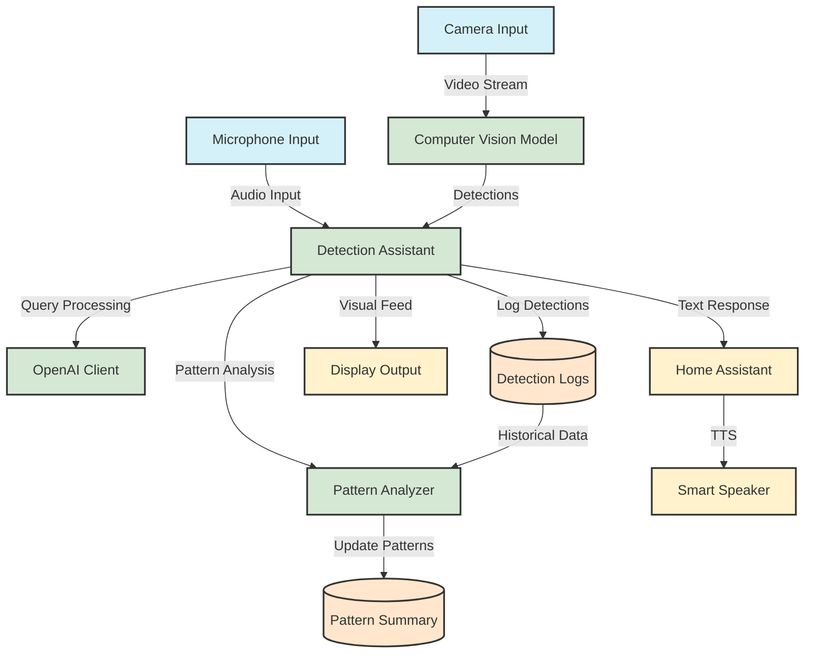

# System Architecture

This diagram shows the high-level architecture of the vision-aware assistant system. Here's a brief explanation of each component:

## Input Devices
- **Camera**: Captures video stream for object detection
- **Microphone**: Captures voice commands and queries

## Core Components
- **Computer Vision Model**: Performs real-time object detection on video stream
- **Detection Assistant**: Main component that coordinates all other parts
- **Pattern Analyzer**: Analyzes detection patterns over time
- **OpenAI Client**: Processes natural language queries

## Data Storage
- **Detection Logs**: Stores historical detection data
- **Pattern Summary**: Stores analyzed patterns and trends

## Output Devices
- **Display**: Shows video feed with detection overlays
- **Text-to-Speech**: Converts responses to speech
- **Home Assistant**: Handles audio output and integration
- **Smart Speaker**: Plays the assistant's spoken responses

## Key Interactions
1. Camera feeds video to Computer Vision for detection
2. Detections are logged and analyzed for patterns
3. Voice commands are processed by the Assistant
4. Responses are converted to speech via Home Assistant and played on the Smart Speaker
5. Historical data is used to answer pattern-related queries 